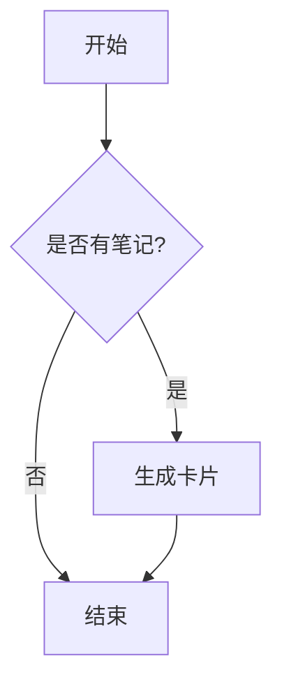
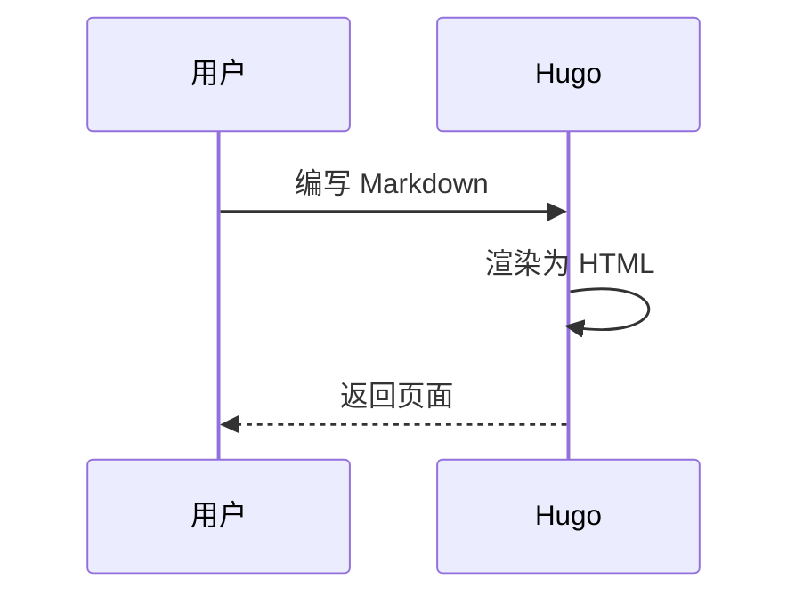

本文演示本站博客支持的全部 Markdown 能力。你只需在 `content/blog/` 下新建 `.md` 文件，用纯 Markdown 编写即可。

## 表格

| 特性 | 语法 | 状态 |
| --- | --- | --- |
| 表格 | `\| a \| b \|` | ✅ |
| 脚注 | `[^1]` | ✅ |
| 任务列表 | `- [x]` | ✅ |
| Mermaid | ` ```mermaid ` | ✅ |
| 数学公式 | `$$ ... $$` | ✅ |

## 代码块（含语法高亮）

```python
def greet(name: str) -> str:
    return f"Hello, {name}!"

print(greet("WeRead"))
```

## Mermaid 流程图



再来一个时序图：



## 数学公式

行内公式 $E = mc^2$ 与独立公式：

$$
\int_{-\infty}^{+\infty} e^{-x^2}\,dx = \sqrt{\pi}
$$

## 引用

> 读一本好书，就是和许多高尚的人谈话。 —— 歌德

## 任务列表

- [x] 接入微信读书数据
- [x] 卡片化博客
- [ ] 上线 Gallery

## 定义列表

Hugo
: 一个用 Go 编写的静态站点生成器

Mermaid
: 基于文本的图表绘制工具

## 脚注与删除线

本站支持脚注[^1]和~~删除线~~。

[^1]: 这是脚注内容，会显示在文章末尾。
